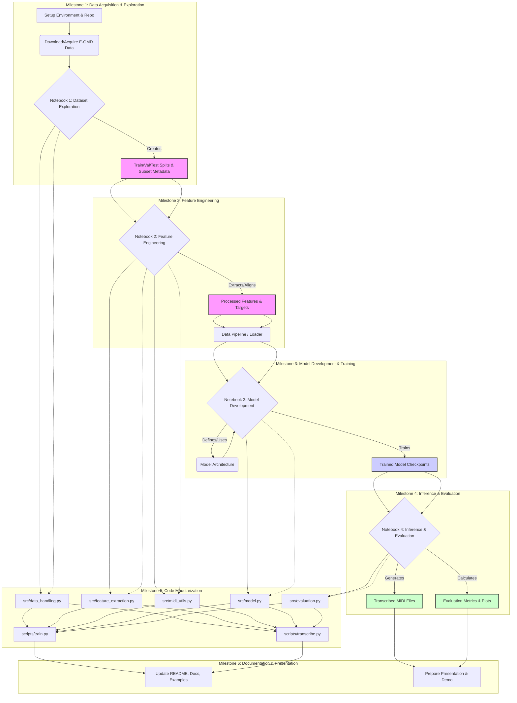

# TASK.md

## 📊 Project Workflow Visualization

This diagram illustrates the overall workflow, showing the progression through milestones and the relationships between different components.

**Explanation:**

1.  **Milestones 1-4 (Notebook Focus):** The core workflow starts with data acquisition and exploration (Notebook 1), moves to feature engineering (Notebook 2), then model development (Notebook 3), and finally inference/evaluation (Notebook 4). Key outputs like data splits, processed features, and trained models link these stages.
2.  **Milestone 5 (Modularization):** This milestone refactors the logic developed in the notebooks into reusable Python modules (`src/`) and command-line scripts (`scripts/`). The dashed lines indicate that the code originates from the notebooks.
3.  **Milestone 6 (Final Touches):** Documentation and presentation build upon the completed code and results.

---

## 💾 Milestone 1: Dataset Acquisition & Exploration

- [x] **Project Setup**

  - [x] Create and configure Python virtual environment
  - [x] Install core dependencies (librosa, numpy, matplotlib, pytorch, etc.)
  - [x] Create proper directory structure for data organization
  - [x] Set up version control and initial repository

- [x] **E-GMD Dataset Acquisition**

  - [x] Download the E-GMD dataset (or a portion of it)
  - [x] Understand dataset structure and organization
  - [x] Set up metadata handling for audio-MIDI pairs

- [x] **Notebook 1: Dataset Exploration & Subsetting**
  - [x] Create notebook `notebooks/01_dataset_exploration.ipynb`
  - [x] Explore E-GMD structure: audio files, MIDI annotations, metadata
  - [x] Visualize examples of audio waveforms and corresponding MIDI
  - [x] Develop strategy for creating a manageable subset
  - [x] Implement subset extraction pipeline
  - [x] Create balanced train/validation/test splits
  - [x] Generate dataset statistics and visualizations

## 🔍 Milestone 2: Feature Engineering & Data Preparation

- [ ] **Notebook 2: Feature Engineering**

  - [x] Create notebook `notebooks/02_feature_engineering.ipynb`
  - [x] Implement audio preprocessing (resampling, normalization)
  - [x] Extract Mel spectrograms with different parameters
  - [x] Visualize spectrograms and compare configurations
  - [x] Extract onset and velocity information from MIDI files
  - [x] Align audio features with MIDI ground truth
  - [ ] Create and save training examples

- [ ] **Data Pipeline Development**
  - [ ] Create efficient data loader for batched processing
  - [ ] Implement on-the-fly data augmentation
  - [ ] Develop feature caching mechanism for faster training

## 🏗️ Milestone 3: Model Development & Training

- [ ] **Notebook 3: Model Development**

  - [ ] Create notebook `notebooks/03_model_development.ipynb`
  - [ ] Design model architecture for both onset and velocity prediction
  - [ ] Implement model in PyTorch
  - [ ] Define appropriate loss functions
  - [ ] Create training loop with metrics tracking
  - [ ] Implement validation procedure
  - [ ] Visualize training progress
  - [ ] Save model checkpoints

- [ ] **Model Refinement**
  - [ ] Experiment with different architectures
  - [ ] Tune hyperparameters
  - [ ] Implement early stopping and learning rate scheduling
  - [ ] Evaluate model performance on validation set

## 📊 Milestone 4: Inference & Evaluation

- [ ] **Notebook 4: Inference & Evaluation**

  - [ ] Create notebook `notebooks/04_inference_evaluation.ipynb`
  - [ ] Implement inference pipeline
  - [ ] Develop post-processing for predictions
  - [ ] Convert model outputs to MIDI
  - [ ] Calculate evaluation metrics (F-measure, MAE for velocity)
  - [ ] Create visualizations comparing predictions to ground truth
  - [ ] Generate audio renderings of predicted MIDI

- [ ] **Final Evaluation**
  - [ ] Evaluate best model on test set
  - [ ] Create comprehensive evaluation report
  - [ ] Compare with existing methods in literature

## 📦 Milestone 5: Code Modularization & Package Creation

- [ ] **Extract Core Functionality**

  - [ ] Create Python modules from notebook code:
    - [ ] `src/data_handling.py`: Dataset processing and loading
    - [ ] `src/feature_extraction.py`: Audio feature extraction
    - [ ] `src/midi_utils.py`: MIDI processing utilities
    - [ ] `src/model.py`: Model architecture definition
    - [ ] `src/evaluation.py`: Metrics and evaluation functions

- [ ] **Create Simple Interface**
  - [ ] Implement training script `scripts/train.py`
  - [ ] Create inference script `scripts/transcribe.py`
  - [ ] Add command-line options for key parameters

## 📚 Milestone 6: Documentation & Presentation

- [ ] **Project Documentation**

  - [ ] Update README.md with detailed instructions
  - [ ] Document API and usage examples
  - [ ] Add comments and docstrings to all code
  - [ ] Create demo notebook with end-to-end example

- [ ] **Prepare Class Presentation**
  - [ ] Create slides summarizing approach and results
  - [ ] Prepare audio examples comparing original and transcribed drums
  - [ ] Set up live demo
  - [ ] Document limitations and future work
